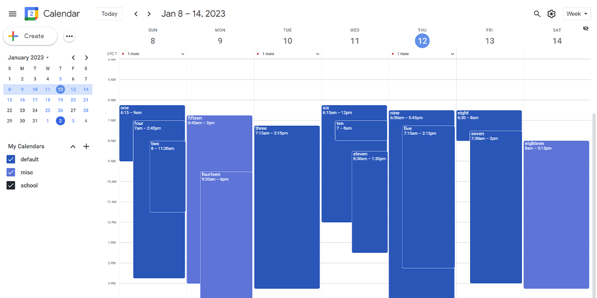
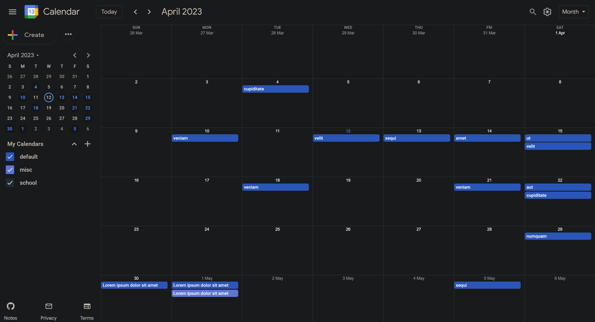

# Google Calendar Clone

demo: lightmode / weekview


demo: darkmode / monthview


Contact: ottofy@zohomail.com

[Live project link](https://chaseottofy.github.io/google-calendar-clone-vanilla/)

[App Screenshots](https://flic.kr/s/aHBqjAqx9t)

## Documentation

**This Documentation is a work in progress.**

I am currently working on a dev.to writeup that will follow more as a tutorial. If the feedback is positive, I will consider making a step by step tutorial in video format but it could potentially be around 10 hours long so I'm still gauging interest. Please let me know if you would be interested in this by contacting me directly via email (ottofy@zohomail.com).

____________

## Glossary

1. [About](#about)

2. [Cloning](#cloning)

3. [Journal](#journal)

4. [Cloning](#cloning)

5. [Events](#events)

6. [Drag_Systems](#drag_systems)
  
7. [Resize_Systems](#resize_systems)

8. [Date_Handling](#date_handling)

9. [Time_Handling](#time_handling)

10. [Form_Handling](#form_handling)

11. [Views](#views)

12. [Rendering](#rendering)

13. [Storage](#storage)

____________

## About

* Recreation of the google calendar app in its entirety (aside from components that utilize google apis).
* Zero third party resources used (aside from webpack & google-svgs)
* All code is written in vanilla javascript, html, and css.

At the moment, the application works using local storage but there are options to backup data and load previously saved data using json.

### Benchmarks & Features that differ from the original Google Calendar

* **Performance:**
  * Transfer size:
    * Google: 3MB.
    * Clone: 100kb.
  * Bundle Size (JS):
    * Google: 2.7MB.
    * Clone: 40kb.
  * Lighthouse:
    * Google: [77, 98, 92, 70].
    * Clone: [100, 100, 100, 100].
  * Responsive down to:
    * Google: 860px.
    * Clone: 280px.

* **Three themes:**
  * Dark.
  * High Contrast.
  * Light (same as google).

* **Keyboard Shortcuts:**
  * **Differ slightly from the original app.**
  * 29 in total.
  * New Shortcuts:
    * Toggle sidebar open/closed.
    * Open event and category forms.
    * Datepicker: set date to next&prev month/week.
    * Datepicker: set date to next&prev days.

* **Datepicker now has:**
  * Monthpicker.
  * Yearpicker.
  * Days with events are highlighted.
  * Current week highlighted when in weekview.

* **Download/Upload:**
  * All calendar events/categories/settings can be downloaded & uploaded.
    * Uploading data will overwrite existing data.

* **Other:**
  * Monthview cells are highlighted when dragged over.
  * Resize bar for week & day events.
  * 42 color options for categories.
  * Move all events from one category to another.
  * Single page. No page refreshes, no load times.
  * Aggressive memory handling.
  * At MAX there will be 8 active event listeners.
  * Sidebar converts to fixed positioning under 840px and main content inherits the full page width.
  * Turn animations/transitions on and off.
  * animation times adjusted.
  * More details provided for when events start/end/ended **(see Jan 20th journal).**
  * Sorting animations for month/week/day view events.
  * Dayview header details how many entries are starting/ending on that day and the timeframes of first - last entry.
  * Yearview will automatically scroll to current selected month if not in view.
  * Yearview days with events are highlighted.
  * Dayview will automatically scroll to the top of first event if it is not in view.
  * Throttling optimized to always ensure content is visible during any keydown action.

____________

## Cloning

### `git clone`

### `cd google-calendar-clone-vanilla`

### `npm install`

## Available_Scripts

### `npm run build`

Builds the app and **necessary** resources in the `dist` folder.

### `npm run dev`

Webpack: Starts development server on `localhost:3000`.

____________

## Journal

### Jan 16, 2023

* **build list/agenda view prototype**.
* Category change name bug fix.
* Mobile query clean up.

### Jan 17, 2023

* Weekview now has max-width and horizontal scroll below 560px.
* improve list/agenda view.
* timepicker staging (form).
* improved context menus.
* links now crawable.
* improved keyframes.

### Jan 20, 2023

* Entry popup modlas will now provide the following details :
  * If the entry has ended, display the time since it ended.
  * If the entry ends today and has started, display a countdown until complete.
  * If the entry ends today and hasn't started, display the length in hours/minutes.
  * If the entry ended yesterday, display "ended yesterday".
  * If the entry is yet to start and is not in the past, display how long until it is scheduled to start.
* Improve collisions

### Jan 23, 2023

* Click on datepicker title to open a month/year picker.
  * header datepicker
  * sidebar datepicker
  * form datepicker
* Added date search component
* New category options (turn all others off/on) || edit
* Added dynamic form drag
  * shrinks and grows if dragged away/into corners
* All modals are now dynamic (mobile support)
  * Will open to left if no space on right of target & viceversa
  * Will open above if no space below target & viceversa
* Added switch to turn animations/transitions on and off in settings
* Added top modal compartment for dayview (events that span longer than the calendar day)
* Added floating eye icon to open/close the header for the week and day view (mobile support)

### Jan 24, 2023

* Prepare Production build & implement linter.
* Start trimming bundle.

### Feb 1, 2023

* Toast popups:
  * Allow user to "undo" any edits to events.
  * Allow user to remove new events.

### Feb 12, 2023

* Reduce HTML size where applicable to avoid lighthouse excessive DOM size warning.
  * Main culprit of was the yearview display. Reduced size from 2400 elements to 1200 elements.
* Optimize animations/keyframes.
* CSS Detailing.

### Feb 16, 2023

* Improve collision detection for day/week.

### Feb 23, 2023

* Improve tab support and html semantics.

____________

## Events

### 1. [Lifecycle](#lifecycle)

### 2. [Delegation-Example](#delegation-example)

### 3. [Garbage-Collection](#garbage-collection)

### 4. [Modal-Form-Events](#modal-form-events)

This application relies heavily on Event Delegation, the idea of administering events through a common parent element. The main benefit to this is the lack of actual listeners registered to the DOM.

## Lifecycle

**At most, 7 of the following 10 handlers will be present in the DOM at the same time.**

1. `window: resize` - for resizing the window (only in monthview).
2. `document: keydown` - for handling keyboard events.
3. `document: onclick` - for handling clicks on the overlay.
4. `document: onmousemove` - for handling drag / resize.
5. `document: onmouseup` - for handling drag / resize.
6. `modal/form: onmousedown` - for handling clicks on one of the several modals or two forms.
7. `dayview/weekview/monthview/yearview/listview: onmousedown` - calendar events are delegated from their respective views. Only one of these listeners will be active at a time.
8. `header: onmousedown` - handles all header related events. This is the only mouse event that is not subject to change. Establishes once and remains active.
9. `sidebar datepicker: onclick` - only active when sidebar is open.
10. `sidebar categories: onclick` - only active when sidebar is open.

## Delegation-Example

```javascript
function getClosest(e, element) {
  return e.target.closest(element);
}

function delegateEvent(e) {
  const targetElement = getClosest(e, ".target-class");
  const targetElement2 = getClosest(e, ".target-class2");

  if (targetElement) {
    // do something
    return;
  }

  if (targetElement2) {
    // do something else
    return;
  }
}

parentElement.onmousedown = delegateEvent;
```

## Garbage-Collection

Each time a new calendar view is rendered, the parent element listener from the previous view is removed from the DOM, as well as the elements that were delegated to it. The current view's parent element listener is then added to the DOM and delegation is re-established.

In short, this garbage collection process works as follows:
(In this example, the user is switching from monthview to dayview)

1. Monthview content is rendered.
2. Monthview parent container establishes delegation to its children through the `onmousedown` listener.
3. The global store that is passed through each component is updated with a callback function with instructions to set the `onmousedown` listener to null, and remove all delegated elements.
4. User switches to dayview.
5. Callback provided in step 3 is executed.
6. 1-5 are repeated for each view.

I hope this explanation helps shed some light on how I handle garbage collection however, do not take my word for gospel. I am constantly re-evaluating my approach to this problem. If you are under the impression that I am doing something wrong in this approach, please e-mail me and I will be in your debt.

## Modal-Form-Events

Each modal and form has its own "overlay" DOM element, a transparent `<aside>` element that is positioned absolutely and covers the entire screen just behind the modal / form.

Upon opening, the following happens:

1. The overlay is added to the DOM.
2. The global store is notified of the overlay's existence. This in turn tells the global keydown listener to
temporarily ignore keyboard events.
3. Once the global keydown listener is notified, a new keydown listener is registered to the overlay that will in turn handle "Escape" events and close the modal / form.
4. The modal / form is added to the DOM.
5. The overlay is given an `onclick` listener that will close the modal / form.

Upon closing, the following happens:

1. The overlay and modal / form listeners are removed from the DOM.
2. The global store is notified of the overlay's removal. Global keydown listener is re-registered to the document.

____________

## Drag_Systems

### 1. [Week-Day-Drag](#week-day-drag)

### 2. [Month-Drag](#month-drag)

### 3. [Form-Drag](#form-drag)

There exist four total drag systems throughout the app, three of which are completely different from one another.

## Week-Day-Drag

Setting up this particular Drag System is really the trickiest part of the process.
Steps (i - iii) will cover most of the setup procedure.
Steps (iv) will cover the actual drag and drop system.

### I) [WD-Generating-Coordinates](#wd-generating-coordinates)

### II) [WD-Setup-Positioning](#wd-setup-positioning)

### III) [WD-Administer-Positioning](#wd-administer-positioning)

### IV) [WD-DragEngine](#wd-dragengine)

**This particular grid system operates as a 24 hour clock, with each hour being divided into 4 15 minute intervals.**

Each column has relative positioning and a fixed height of 1200px.

What makes this grid system particularly unique is the fact that columns do not technically have rows. Instead, each column is a container for a series of divs (entries) that are positioned absolutely.

The visual representation of rows is created by a background image (linear-gradient) defined in the parent containers css.

* Weekview Grid Container:
  * background-size: calc(100% / 7) 4%;
    * (7 days in a week, 4% of the height of each column).
  * background-image: linear-gradient(to bottom, var(--mediumgrey1) 1%,transparent 0);
    * (1% of the height of each column).

* Dayview Grid Container:
  * background-size: 100% 4%
    * (1 day, 4% of the height of each column).
  * background-image: linear-gradient(to bottom,var(--mediumgrey1) 1%,transparent 0)
    * (1% of the height of each column).

The parent container is also given a fixed height of 1200px, and each column within the container is given relative positioning / min-height of 100%.

The fixed height is necessary to ensure that the background-image linear gradient always coincides with the correct calculated row height. Screen width luckily does not affect the background-image gradient, so it only needs to be calculated once.

## WD-Generating-Coordinates

The coordinates for each entry are generated based on the start/end time of each entry.

### **a) : convert the start/end time of each entry into minutes.**

For example, if an entry starts at 9:30, it will be converted to 38, since 38 represents the number of 15 minute intervals from 12:00AM

```javascript
const startMinutes = start.getHours() * 4 + Math.floor(start.getMinutes() / 15)
const endMinutes = end.getHours() * 4 + Math.floor(end.getMinutes() / 15)
const height = endMinutes - startMinutes
const total = startMinutes + height
```

### **b) : determine whether an entry extends beyond a day by comparing the start/end day/week/year of entry**

**Coordinates:**

* Entry extends beyond a day:
  * allDay: true,
  * x: start.getDay() (day of the week),
  * x2: end.getDay() (day of the week),

* Entry does not extend beyond a day:
  * allDay: false,
  * x: start.getDay(),  (column of the day)
  * y: startMinutes,    (first row of entry)
  * h: height,          (total number of rows)
  * e: total,           (last row of entry)

## WD-Setup-Positioning

**Take note of the following:**
Each entry is positioned absolutely within its column. The top & height properties are calculated based on the coordinates calculated in step 2.

### **a) Calculate top & height properties for boxes inline-syling.**

```javascript
const top = (y * 12.5) + 'px'
const height = (h * 12.5) + 'px'
```

### **b) Provide the entry with a slew of data attributes that will be used for repositioning/collision handling after drag/resize events.**

**Important! From this point on I will be referring to entries as boxes.**

**Data Attributes**:

* Entries that start and end on the same day:
  * dataIdx: boxes are sorted by their y coordinates (start hour/min) before they are assigned for DOM placement. This attribute is necessary for collision handling.
  * dataId: the id of the entry that the box represents.
  * dataCol: the column that the box is placed in. (day of week)
  * data-start-time: starting row of the box (y).
  * data-time-intervalas: height of the box (h).
  * data-end-time: ending row of the box (e).
  * data-box-category: the category of the entry that the box represents. (used for color coding).

* Entries that start and end on different days (allDay):
  * dataIdx: same as above.
  * dataId: same as above.
  * data-start: x (day of week event starts).
  * data-end: x2 (day of week event ends).
  * data-box-category: same as above.

### **c) Define system to calculate the left & width properties of each box.**

This process is relatively simple for entries that start and end on different days since their position is static.

For entries that are not allDay, things begin to get a little more complicated at this very point.

Calculating collisions is a crucial part of this process and the whole reason why I had to create this custom grid system in the first place.

When it comes to collision handling, with a drag system that allows for essentially inifinte entries, four things become very important:

i.) The order in which the boxes are placed in the DOM.

ii.) The z-index of each box.

iii.) The left positional property of each box.

IV.) the width positional property of each box.

"i.)" and "ii.)" are both relatively simple to solve. The boxes are sorted by their y coordinates (start hour/min) before they are even given data attributes or classes for that matter.

Once the boxes are sorted by their y coordinates, they are given a z-index value based on their index in the sorted array to further ensure that the boxes are placed in the correct order in the DOM.

**"iii.)" and "IV.)" are a little more complicated.**

By default, the left and width properties are as follows:

* (width of column - small offset) * (percentage amount to offset from column +/- small offset)

```css
left: calc((100% - 4px) * 0 + 0px);
width: calc((100% - 4px) * 1 - 0px);
```

### **d) Basic Example**

**Now lets take a look at a basic collision and how to handle it:**

Box 1: 9:00AM - 10:00AM

Box 2: 9:30AM - 10:30AM

The first box, Box 1, will keep its default left & width properties in which it inherits the full width of the column and has zero left offset.

The second box, Box 2, will need to be offset from the left by a percentage value of  lets say 0.25 (25%).

In order to prevent the second box from overlapping with adjacent columns or from going off the screen, it's width will need to be reduced by a percentage value as well.

Normally, the width of the second box will be reduced by (100 - left offset) or 75% in this case.

```css
left: calc((100% - 4px) * 0.25);
width: calc((100% - 4px) * 0.75);
```

This works fine for most cases, but when boxes really begin to stack up, it helps to reduce the width of boxes so that there is some horizontal space between them. This allows boxes behind other boxes to be selected in between the crevices of the boxes that are on top of them.

Currently, there are 15 different pairs of left & width properties that a box can inherit. To see the full list of potential property values, check out the @dragutils.js file @function setBoxWidthWeek.

The section below will explain how these values are assigned.

## **WD-Administer-Positioning**

### **a) Determine whether or not a collision has occurred**

Note that this is not necessary if only one box is present in the column.
Collision detection will only occur if there are two or more boxes in the column.
./src/factory/entries.js (@function checkForCollision())

```javascript

const arr = [];
let collisions = new Set();

// push the y & e coordinates of each box into an array
for (const box of bxs) {
  arr.push([box.coordinates.y, box.coordinates.e]);
}

// populate the collisions set with boxes that 
// interset with each other either at 
// their start (y) or end (e) coordinates
for (let i = 0; i < arr.length; i++) {
  for (let j = i + 1; j < arr.length; j++) {
    if (arr[i][1] > arr[j][0] && arr[i][0] < arr[j][1]) {
      collisions.add(bxs[i]);
      collisions.add(bxs[j]);
    }
  }
}

// sort the collisions set by their y coordinates (start hour/min)
// the reasoning for this is explained in the "a.)" section above
return [...collisions].sort((a, b) => {
  let diff = +a.coordinates.y - +b.coordinates.y;
  if (diff === 0) {
    return +a.coordinates.e - +b.coordinates.e;
  } else {
    return diff;
  }
})
```

### b.) assign the left & width properties of each box

./src/utilities/dragutils.js (@function handleOverlap())

```javascript
const collisions = checkForCollision(bxs);

for (let i = 0; i < collisions.length; i++) {
  const box = document.querySelector(`[data-id="${collisions[i].id}"]`);
  let idx = i;
  // handle instance where there are more than 15 boxes in a column.
  if (i >= 15) { i -= 14; } 

  // assign identifier
  box.setAttribute("class", `box box-${i + 1}`)
  // call @setBoxWidthDay() or @setBoxWidthWeek() 
  // this assigns the left & width properties based on given identifier
  view === "day" ? setBoxWidthDay(box, idx) : setBoxWidthWeek(box, idx);
}
```

./src/utilities/dragutils.js (@function setBoxWidthDay/Week())

setBoxWidthDay() && setBoxWidthWeek() assign the left & width properties of each box.

They are separated because the left & width properties are different for the day/week view.

I've also opted to hard code the left & width properties because there really isn't a discernable pattern to getting them right... at least not one that I could figure out.

```javascript
function setBoxWidthDay(box, prepend, dataidx) {
  const attr = box.getAttribute(dataidx);
  switch (attr) {
    case `${prepend}one`:
      box.style.left = 'calc((100% - 0px) * 0 + 0px)';
      box.style.width = "calc((100% - 4px) * 1)"
      break;
    case `${prepend}two`:
      box.style.left = "calc((100% - 0px) * 0.15 + 0px)"
      box.style.width = "calc((100% - 4px) * 0.85)";
      break;
    case `${prepend}three`:
      box.style.left = "calc((100% - 0px) * 0.30 + 0px)"
      box.style.width = "calc((100% - 4px) * 0.70)";
      break;
    // etc...
    default:
      break;
  }
}
```

## **WD-DragEngine**

The biggest detail to note about the drag engine is that it does not use javascripts drag & drop API. Another key detail: the drag engine will treat the event as a click until 3px of movement is detected. Only until 3px of movement occurs will the actual drag process begin.

### a) Setup for a potential drag event

**Setup process:**

1.) The user clicks and holds down on a box.
2.) Listeners are added to the document to listen for mousemove and mouseup events.
3.) Starting positions of the box are created to handle instances where the box is moved around the grid and then returned to its original position.

```javascript
const startTop = +box.style.top.split("px")[0]
const boxHeight = +box.style.height.split("px")[0]
```

4.) Variables that contain the original mouse positions are set (x & y), these are not subject to change. originalColumn will also not change, currentColumn will change if the box moves to a new column. movedY & movedX will track the mouse movements for the below flag.

```javascript
let startCursorY = e.pageY - grid.offsetTop;
let startCursorX = e.pageX
const originalColumn = col.getAttribute("data-column-index");
let currentColumn = col.getAttribute("data-column-index");
let [movedY, movedX] = [null, null]
```

5.) A flag called "hasStyles" is created and set to false. If the below variables track movement beyond 3px either vertically or horizontally at any point, the flag will be set to true and a clone of the box will be appended to the DOM. The original box is then given .5 opacity and the document body's cursor is set to "move". The cloned box will now follow the mouse movements in intervals of 12.5px vertically, and between columns if in week view.

```javascript
// determine if dragging should begin.
sX = Math.abs(e.clientX - startCursorX);
sY = Math.abs(e.clientY - tempstartY);
if (!hasStyles) {
  if (sX > 3 || sY > 3) {
    hasStyles = true;
    document.body.style.cursor = "move";
    if (box.classList.contains("box-ontop")) {
      boxhasOnTop = true;
      resetStyleOnClick("week", box);
    }
    box.classList.add("box-dragging")
    createTemporaryBox(box, col, boxhasOnTop, "week")
    sX = 0;
    sY = 0;
  }
}
```

6.) If dragging is not registered and the user has already released the mouse, the mouseup function will be called. Otherwise, horizontal / vertical tracking will begin below.

**Vertical Movement:**

```javascript
// Tracking vertical movement
// get header offset (offset between the fixed app header and the top of the grid wrapper)
const headerOffset = grid.offsetTop;

// track the offset between the header and the mouse
const currentCursorY = e.pageY - headerOffset;

// calculate the difference between the original mouse position and the current mouse position
let newOffsetY = currentCursorY - startCursorY;

// calculate the new top position of the cloned box
// ensure that the new top position is an increment of 12.5px (15 minutes)
let newTop = Math.round((newOffsetY + startTop) / 12.5) * 12.5;

// ensure that the new top position does not exceed the top or bottom of column
if (newTop < 0 || currentCursorY < 0) {
  newTop = 0
  return;
} else if (newTop + boxHeight > 1188) {
  return;
}

// set the cloned box's top position
box.style.top = `${newTop}px`;
```

**Horizontal Movement, Week view only:**

The following is a bit more involved than the vertical movement because the user can move a box to a different column.

```javascript
// create variables to hold the following:
// 1.) track the offset between original mouse position and current mouse 
//     position to determine whether the user is moving left or right/
// 2.) current e.pageX
// 3.) offset between startCursorX and currentCursorX
// 4.) the previous column's left position (or null if there is no prev column)
// 5.) the next column's left position (or null if there is no next column)

const direction = e.pageX - startCursorX > 0 ? "right" : "left"
const currentCursorX = e.pageX
let newOffsetX = startCursorX - currentCursorX

// @function getcol() returns the column dom element at given index
let leftColX = currentColumn - 1 >= 0 
  ? parseInt(getCol(currentColumn - 1).getBoundingClientRect().right) 
  : null;

let rightColX = currentColumn - 1 >= 0 
  ? parseInt(getCol(currentColumn + 1).getBoundingClientRect().left) 
  : null;

// if the direction is right and the next column is not null, 
// append the cloned box to the next column and 
// update the current column variable
if (direction === "right" && rightColX !== null) {
  if (e.pageX >= rightColX) {
    getcol(+currentColumn + 1).appendChild(box)
    startCursorX = e.pageX
    currentColumn = +currentColumn + 1
    box.setAttribute("data-box-col", +currentColumn)
  }
}

// left movement follows the same process as the 
// right movement, but using subtracting instead of adding
```

7.) User releases mouse, Mouseup function is called where two distinct actions can occur depending on whether the user has initiated dragging or not.

```javascript
// query select the cloned box and define it as a temporary box
const tempbox = document.querySelector(".temporary-box")

// if there is no temporary box, the user never initiated dragging,
// treat as click event and open the box's context menu where 
// the user can choose to open the box's edit form or delete the box.
// This process is detailed in the @Form_Handling Section

if (tempbox === null) {
  // check @Form_Handling for more details
} else {

  // remove cloned box
  tempbox.remove();

  // function to format the box's time attribute
  setBoxTimeAttributes(box, "day or week");

  // use formatted time attribute to calc the new start/end times
  const time = calcTime(
    +box.getAttribute("data-start-time"),
    +box.getAttribute("data-time-intervals")
  );

  // update the start/end times useing calculation above
  box.setAttribute("data-time", time);
  box.children[1].children[0].textContent = time;

  // update the store with the new coordinates
  updateBoxCoordinates(box, "week", boxes);
  boxes.updateStore(
    store,
    box.getAttribute("data-box-id"),
    weekArray
  );

  // if box is moved to a new column, update sidebar datepicker 
  if (currentColumn !== +originalColumn) {
    renderSidebarDatepickerWeek()
  };

  // This is where the overlap handling comes 
  // into play detailed in the @Administer-Positioning section
  let droppedCol = +box.getAttribute("data-box-col");
  if (boxes.getBoxesByColumn(droppedCol).length > 1) {
    handleOverlap(droppedCol, "week", boxes)
  } else {
    box.setAttribute("box-idx", "box-one")
  }

  // set documents cursor to normal and tells the 
  // store that other events can now be registered
  setStylingForEvent("dragend", main, store)

  // remove event listeners
  document.removeEventListener("mousemove", mousemove)
  document.removeEventListener("mouseup", mouseup)
}
```

## Month-Drag

### I) [MV-Setup-Positioning](#mv-setup-positioning)

### II) [MV-Administer-Positioning](#mv-administer-positioning)

### III) [MV-DragEngine](#mv-dragengine)

### IV) [MV-Grouping](#mv-grouping)

The Month Drag/Grid system follows a fairly similar procedure to the Week/Day drag system but is just different enough to warrant its own section entirely.

Some of the functions are re-used I will not be going into too much detail on them.

This particular view is very easy to underestimate. No it is not overly difficult to conceptualize, and getting a basic version running is relatively easy.

The money here is 100% in the details.
The details are what make this view so difficult to implement.
The details are what make this view so difficult to maintain.
The details are what make this view so difficult to scale.

Yes, I am aware I missed a few details myself, namely the ability to resize boxes horizontally across cells / have the length of boxes be represented across multiple days.

Until about a month ago, believe it or not, I did have this kind of feature implemented for a few days before removing it.Perhaps I will revisit it in the future but I'm really not sold on the idea... I digress.

I will cover how I solved the problems below but I advise you to self council before going further. (How you would solve/implement the features listed below? Do you immediately see the issue?)

* A dynamic grid with 35-42 cells depending on the month.
* Cells can hold up to 6 boxes at a time.
* If more than 6 boxes are in a cell, remove all boxes from the cell and populate the cell with div indicating the number of events on that day.
  * Clicking on the div will open a modal with all of the boxes in that cell.
  * The modal should essentially be a larger cloned version of its respective cell.
  * Boxes in the modal should be able to be dragged out of the modal and into the calendar.
  * They should also be able to be dragged back into the modal.
* Drag boxes to any cell, if the cell is full, group all boxes in that cell and create the modal described above.
* Boxes must be clickable AND draggable.
* Click on empty cell to open form on that day.
* Responsive design : boxes have inline styles, they must rely on some resize event for recalculation. System should only ever fire once per designated change and should be garbage collected if month is not in view.
* No more than 4 active listeners at any given time.

## MV-Setup-Positioning

Unlike the day & week view, the monthview grid does not have a fixed height, nor does it have a fixed number of rows. To accommodate this, this grid system uses a combination of flexbox, absolute positioned elements, and a query system attached to window resize events that will help recalculate the inline styles of boxes.

Lets get the elephant in the room out of the way first. (the query system?)

One thing that my grid systems all have in common is an abundance of inline styles. These are great for handling elements with positions that are always changing, and changing in large amounts (i.e. dragging an element from the first of the month to the 31st).
Unfortunately, they pose a real problem for responsive design. The reason for a query system in this view and not the others is because the month view has zero fixed positioning.

**Query System**
The idea is simple. Create a class that sets a flag to true if a certain width/height threshold limit has been hit, and return an array of height/width values based on the value of the flag.

Anytime the window is resized, the query system will be notified. If the previous flag value is different from the current flag value, the query system will proceed to update the inline styles of all boxes in each cell. (more on this later).

Note that the callback to run the query is attached to the window which is delegated through a debounce (100ms). Also, the window does not actually inherit the query system from the monthview function itself. Instead, the query system is passed to the global store and is attached to the window from @setViews() where it is also removed when the monthview is no longer in view.

```javascript
class MonthBoxQuery {
  constructor(flag) {
    this.flag = flag;
    this.tops = [16, 20];
    this.heights = [14, 18];
  }

  updateFlag() {
    this.flag = window.innerWidth <= 530 || window.innerHeight <= 470;
  }

  getFlag() {
    return this.flag;
  }

  getTop() {
    const [a, b] = this.tops;
    return this.flag ? a : b;
  }

  getHeight() {
    const [a, b] = this.heights;
    return this.flag ? a : b;
  }

  getPrevTop(top) {
    const [a, b] = this.tops;
    return top === a ? b : a;
  }
}
```

### Cells_Boxes

Much of this will be covered  in the MV-Administer-Positioning section.

The cells are as bare bones as I could make them. Each cell has a clickable header that will navigate users to the dayview, and the cell content which holds either the grouped box or boxes. Note that the cell content is positioned relatively, and the boxes are positioned absolutely. This is important because of the the inline styles applied to boxes. Positioning them absolutely, even though they are not dragging, makes it easier to apply query styles and have them scale to specific top and height values.

## MV-Administer-Positioning

The monthview grid will either have 35 or 42 cells depending on the month. This is mainly determined by whether or not the month spans 5-6 weeks (most span 4 weeks). The only edge case is Febraury which occasionally only spans 4 weeks.

One interesting aspect of the monthview cells is the coordinate system used.

Cells are given a data attribute essentially describes their respective x, y positions in the grid. (i.e. data-coord="0,0" would be the top left cell, data-coord="6,0" would be the top right cell, data-coord="0,5" would be the bottom left cell, and data-coord="6,5" would be the bottom right cell). More on this @MV-DragEngine.

Boxes in month cells, as described above, are positioned absolutely. The top value is calculated by multiplying the index of the box by the height of the box + the top margin of the box.

Only one data attribute is given to each box - the id of the event it represents.

## MV-DragEngine

### Setting up the drag engine (onmousedown)

The process looks exaclty like the day/weekview in the very beginning but is actually much more involved.

Note that boxes do not show movement until the cursor is moved beyond the border of the cell.

The drag engine is initiated through a delegated mousedown event regisetered on a box. Once the event registered, and while the mouse is still down, a number of things happen:

1.) Create variables to account for the cell the box is in, the box itself, and the target modal if it exists (see  @mv-grouping).

2.) add class to cell signifying that is is being dragged over.

3.) get coordinates of the cell (x, y values) @see mv-administer-positioning.

```javascript
const startDragTime = Date.now()
const parent = box.parentElement;
const cell = parent.parentElement;
cell.classList.add("current-drop-zone");
const targetModal = document?.querySelector(".more-modal");

const originalCellLength = parent.childElementCount;
const [cellX, cellY] = getCoordinatesFromCell(cell);
```

4.) create a clone of the box.

5.) append clone it to the grid body (above the cells).

6.) convert inline styles of cloned box to reflect the relative positioning of the grid body rather than the cell.

```javascript
createTemporaryBox(box);
const clone = document?.querySelector(".box-mv-dragactive");
clone.setAttribute("data-box-mvx", cellX);
clone.setAttribute("data-box-mvy", cellY);

const cellRect = cell.getBoundingClientRect();
const cellWidth = parseFloat(cellRect.width.toFixed(2))
const cellHeight = parseFloat(cellRect.height.toFixed(2));
const wrapperLeft = parseInt(monthWrapper.offsetLeft)
const boxRect = box.getBoundingClientRect();
const boxWidth = parseFloat(boxRect.width);
const boxHeight = boxquery.getHeight()

clone.style.top = `${parent.offsetTop}px`;
clone.style.width = `${boxWidth}px`;
clone.style.height = `${boxHeight}px`;
clone.style.left = `${parent.offsetLeft}px`
clone.style.display = "none"
```

7.) create several variables to test for the following:

  **i. if container currently has five-weeks.**

  **ii. startX, startY,**

  **iii. if drag or click.**

8.) instantiate mousemove and mouseup events.

### monthview mousemove

Simulating click:

No, it is not an actual click event, but there are some ways to make it appear as such.

First, and most importantly, do not allow any styles indicative of a drag event to show until mouse moves at least a few pixels.

Second, supply some sort of flag to indicate that this distance has been met, if not, do not apply any syles and proceed to mouseup event.

The following is a more fleshed out example of the above.

```javascript
movedX = Math.abs(e.clientX - startcursorx);
movedY = Math.abs(e.clientY - startcursory);
// Do not apply styles until user has moved the box at least 5px from starting position.
if (movedX > 1 || movedY > 1) {
  if (!changeCursor) {
    if (targetModal) {
      targetModal.remove();
    }
    document.body.style.cursor = "move";
    changeCursor = true;
  }
}
if (movedX > 3 || movedY > 3) {
  if (!gaveStyles) {
    box.style.opacity = "0.5";
    clone.style.display = "block"
  }
  gaveStyles = true;
}
```

**Calculating_East/West_movement**
x = `Floor((current client x position - grid.offsetLeft) / width of cell)`

```javascript
let newX = Math.floor((e.clientX - monthWrapper.offsetLeft) / cellWidth);

// ensure that the newX is not less than 0 or greater than 6
if (newX < 0) {
  newX = 0;
  return;
}

if (newX > 6) {
  newX = 6;
  return;
}

// update new left position once
if (lastX !== newX) {
  let multX = (newX * cellWidth) + wrapperLeft
  clone.style.left = `${parseFloat(multX.toFixed(2))}px`;
  lastX = newX;
}
```

**Calculating North/South movement**
y = `Floor((current client y position - grid.offsetTop) / height of cell)`

```javascript
let newY = Math.floor((e.clientY - monthWrapper.offsetTop) / cellHeight);

// ensure that the newY is not less than 0 or greater than 5-6
if (newY < 0) {
  newY = 0;
  return;
}
// max : last row (5 weeks)
if (hasFiveWeeks && newY > 4) {
  newY = 4;
  return;
}
// max : last row (6 weeks)
if (!hasFiveWeeks && newY > 5) {
  newY = 5;
  return;
}

// ensure new top position is only calculated if the cursor has moved
// vertically across a cell border
if (lastY !== newY) {
  let multY = (newY * cellHeight) + monthWrapper.offsetTop + 16
  clone.style.top = `${parseFloat(multY.toFixed(2))}px`;
  lastY = newY;
}
```

**give the current cell identifiable class**
This class will be used on mouse up to determine if the box should be removed from the cell or not.

It will also be highlighted during the drag process

```javascript
document.querySelector(".current-drop-zone")?.classList.remove("current-drop-zone");
document.querySelector(`[data-mv-coordinates="${newX},${newY}"]`).classList.add("current-drop-zone");
```

### monthview mouseup

1.) Find the "current-drop-zone" cell.

2.) Get coordinates of new cell.

3.) Get the content of the new cell.

4.) Get array of boxes in the new cell if any.

5.) Determine if the box moved or not during the drag process. If not, open the context menu and remove the clone.

6.) Box moved, one of the following will occur:

  **i. cell had 6 or more elements, remove the clone and update the data attribute inidicating the number of events in the cell (only if the box was moved to a different cell).**

  **ii. cell now has 5 elements, remove the clone and all of the boxes in the cell and replace them with a data attribute indicating the number of events in the cell. (i.e cell is now a grouped cell).**

  **iii. cell has less than 5 elements, remove the clone and append the box to the cell. Re-calculated the top values of the boxes in the cell.**

  **iv. cell is empty, remove the clone and append the box to the cell.**

7.) Remove the current-drop-zone class from the cell.

8.) Remove mousemove, mouseup events and reset the cursor.

## MV-grouping

Grouping is an automatic process that will occur either on load, or when a box is dragged into a cell that has 5 elements.

After a drag, the cell will check for 6 elements, and if true, will proceed to remove all the elements from the cell and replace them with a data-attribte indicating the number of events in that cell. (i.e. data-group="6").

If the grouped cell is clicked, a modal will open with all the boxes in that cell. The boxes will look and act exactly as they would in a normal cell. They can be dragged out of the modal and into the calendar and a context menu will be registered to them as well.
This is achieved by initiating

This modals positiong is calculated using the placePopup function, the same function used to position the context menu and top modals for the day/week views.

```javascript
@param {number} popupWidth 
@param {number} popupHeight 
@param {array} coords - [x: e.clientX, y: e.clientY]
@param {array} windowCoords - [x: window.innerWidth, y: window.innerHeight]
@param {boolean} center - should popup be centered ?
@param {number} targetWidth - if center is true, targetWidth required to center
@returns {array} [x, y] top/left values for popup

function placePopup(popupCoord, boxCoord, windowCoord, center, targetWidth) {
  const [popupWidth, popupHeight] = popupCoord;
  const [boxLeft, boxTop] = boxCoord;
  const [windowWidth, windowHeight] = windowCoords;
  let popupX;

  if (center) {
    popupX = boxLeft - (popupWidth / 2) + (targetWidth / 2);
    if (targetWidth + boxLeft + 4 >= windowWidth) {
      popupX = windowWidth - popupWidth - 4;
    }
  } else {
    popupX = boxLeft + popupW > winW 
      ? boxLeft - popupWidth - 6 
      : boxLeft;
  }

  let popupY = boxTop + popupHeight > windowHeight
    ? windowHeight - popupHeight - 6 
    : boxTop;

  if (popupX < 0) popupX = Math.abs(popupX);
  if (popupY < 0) popupY = 56;
  return [popupX, popupY];
}
```

## Form-Drag

The Form Drag system follows a fairly simple procedure. (Nothing like the month/week/day views).

If you weren't aware that the form even had drag capabilities, try it out for yourself by grabbing on to the form's header (space adjacent to close form button).

____________

____________

## Resize_Systems

Work in progress.

## Date_Handling

Work in progress.

## Time_Handling

Work in progress.

## Form_Handling

Work in progress.

## Views

Work in progress.

## Rendering

Work in progress.

## Storage

Work in progress.

____________
